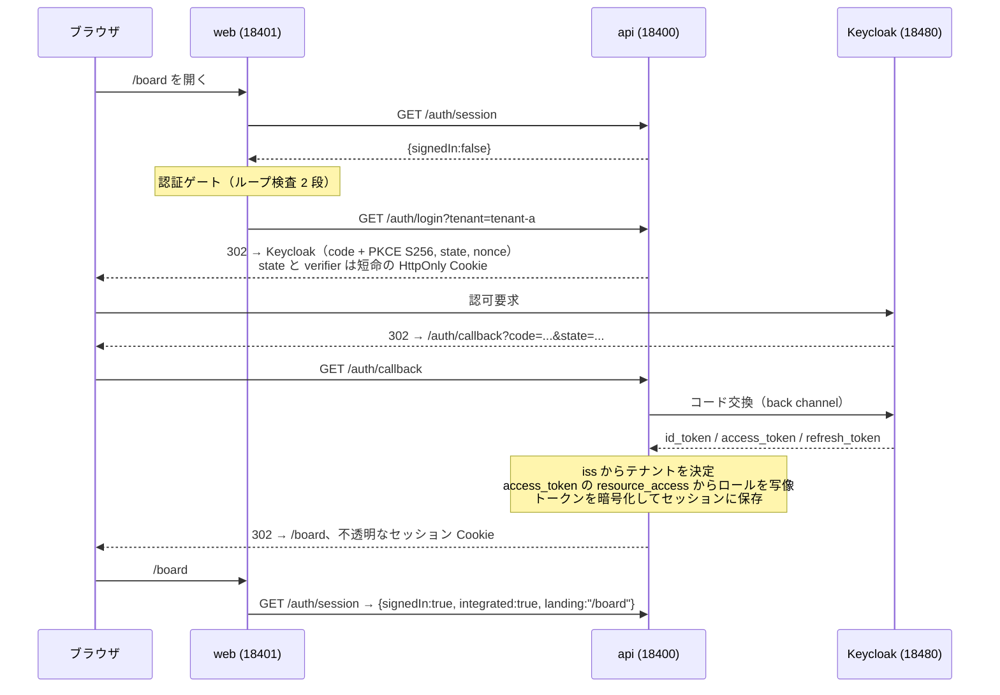
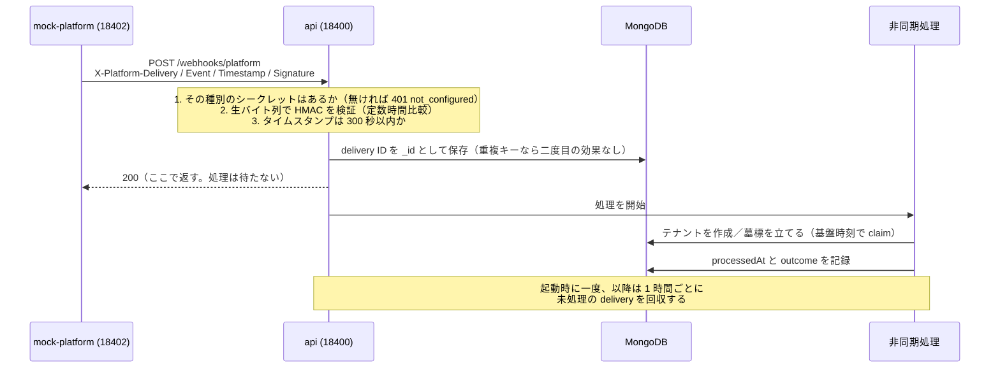

# Acme Tasks — group platform integration demo

**Summary (English).** A runnable demo of adding a group platform's sign-in to an existing multi-tenant
SaaS — the fictional Acme Tasks — without adding a second session: the authorisation code flow with
PKCE ends in the app's own server-side session, a platform Bearer token becomes an in-memory principal,
every permission is decided on the server, and signed webhooks drive tenant sync. Keycloak and a small
mock service stand in for the platform. The repository is also a complete spec-driven example: the spec
folder was implemented by one unattended goal-bus run, whose verdicts are in `goal-pack/PROGRESS.md`.

## 何を示すか

「グループ基盤の IdP でログインできるようにする」という要件を、既存の SaaS に後付けで実装した動くデモです。
題材は架空の製品 **Acme Tasks**（マルチテナントのタスク管理 SaaS）と、架空の **グループ基盤** です。

示したいのは機能の数ではなく、**入口が増えても出口は一つに保つ**という設計が、実際に動く形で成り立つことです。
ブラウザのログインも、他サービスからの Bearer トークンも、最後は自アプリの同じセッションか、メモリ上の
認証主体に収束します。下流のコードは、どちらの経路で入ってきたのかを知りません。

テナントは 3 つです。`tenant-a` と `tenant-b` は基盤と統合済み、`local` は**統合しない**テナントで、
従来どおりパスワードでログインします。`local` が最後まで変わらないことが、このデモの合否の一つです。

もう一つ示すのは、仕様駆動開発（SDD）の一式です。
[`specs/001-idp-tenant-integration/`](specs/001-idp-tenant-integration/spec.md) には、起動書から仕様・計画・
事実表・作業一覧・検証のチェックリストまでがそろっていて、
[spec-driven-dev-playbook](https://github.com/MuneAkira6/spec-driven-dev-playbook) のテンプレート 10 本の
実例になっています。

## 背景

対応する事例は
[01-platform-integration](https://github.com/MuneAkira6/engineering-case-studies/blob/main/01-platform-integration.md)
です。下の「実務で実施した点」は、その事例に記載した内容だけに基づいています。実務の数値や固有名詞は、
このリポジトリには含めていません。

### 実務で実施した点

ここに書いたのは、筆者が実務で扱った基盤統合の事例に記載のある設計判断です。

- 入口が増えても出口は一つ。認可コード + PKCE で入り、自アプリの既存のセッションで終える。下流は変えない。
- 基盤のトークンはサーバー側で暗号化して預かり、自アプリのセッションを基盤のセッションにつなぐ。
- 更新の失敗を区別する。明確な拒否ならセッションを失効、ネットワーク系の一時的なエラーでは殺さない。
- テナントは署名済みトークンの `iss` から導き、`Host` ヘッダーは信用しない。
- 既存 API の Bearer 受理は、既存セッションが無いリクエストに限る。セッションも DB 書き込みも作らない。
- 初回接触の一意化は、部分ユニークインデックスと「重複キーなら読み戻す」。対照群で確かめる。
- ロールは複数クライアントの和集合 → 写像表 → 置き換え。同じなら書かない。写像できないものは降格して警告。
- Webhook は生バイト列で HMAC-SHA256 を検証（定数時間比較・許容 5 分）、イベント ID で一意に保存、
  先に 200 を返して非同期に処理、起動時と毎時に取り残しを回収、シークレットはイベントごとに分ける。
- テナント同期は排他的な claim と墓標。冪等で順不同にも安全。情報が足りなければ client_credentials で
  問い合わせ、「拒否」と「届かない」を区別する。
- デバイスは基盤がイベントを出さないため、毎時とテナント作成時に取得する。失敗しても最終成功時刻は消さない。
- 画面の出し分けは一つのレジストリにまとめ、統合しないテナントでは最初に「隠さない」を返す。
  ログインへの出口は一つの認証ゲートに集め、リダイレクトのループを二段で防ぐ。
- 既定はオフ。
- 並行開発の相手には、名前と形を凍結した契約を先に渡す。

### デモで追加した点

こちらは、このデモのためだけに用意したもので、実務でそうしたという主張ではありません。

- **基盤の代役。** IdP は Keycloak（テナントごとに realm）、イベント・テナント API・デバイス API はモック。
  実務の基盤の挙動を再現したものではなく、設計を確かめるための代役です。
- **SDD → goal 包 → バス。** この仕様の受け入れ条件から goal 包を作り、バスで無人実装しました。
  実務では仕様駆動とバスは別々に使っていました。
- **時計の注入。** 実務では毎時のタイマーを実際に待って確かめました。デモでは注入できる時計で進め、
  そのことをテストに書いています（本番の間隔は実際の値のままです）。
- **モックの操作 API。** 署名の誤り・古いタイムスタンプ・再送・テナント API の拒否や不達を
  テストから起こすための `/__control/*`。
- **一つの Compose。** Keycloak と MongoDB だけを Compose で起動し、Node のサービスはワークスペースから
  直接動かします。

## 設計

| 置き場所 | 中身 |
|---|---|
| `apps/api` | Fastify。ログイン、セッション、Bearer 受理、ロール、権限、Webhook、テナント同期、デバイス取得、定期実行 |
| `apps/web` | React + Rsbuild。認証ゲート、可視性レジストリ、画面 |
| `apps/mock-platform` | グループ基盤の代役。イベント送信、テナント API、デバイス API、テスト用の操作 API |
| `packages/contracts` | API・イベント・基盤 API・可視性・ロール写像表・権限表の凍結済みの型と表 |
| `infra/keycloak/realms` | realm の定義（`platform` / `tenant-a` / `tenant-b`） |
| `specs/001-idp-tenant-integration` | 仕様一式。要件・計画・調査・データモデル・契約・検証シナリオ・測定した事実 |

- **出口は一つ。** 認可コード + PKCE（S256）で入り、自アプリのサーバーサイドセッションで終えます。
  ブラウザが持つのは不透明なセッション ID だけで、基盤のトークンは AES-256-GCM で暗号化してサーバーに
  預かります。`GET /api/*` はセッションがあればそれで決まり、無いときに限り `Authorization` ヘッダーを読みます。
- **テナントは署名済みトークンの `iss` から導く。** `Host` ヘッダーは見ません。
- **更新の失敗を二つに分ける。** 基盤が明確に拒否したらセッションを失効させ、基盤に届かないときは
  セッションを残して 1 時間後に再試行します。「届かない」は利用者について何も語っていないからです。
- **権限はサーバーが決める。** 操作とロールの表は `packages/contracts` に一つだけあり、`/api/*` の
  すべての経路が自分の操作を宣言し、ハンドラーの前に一度だけ検査します。画面は表を持たず、サーバーの
  403 をそのまま出します。
- **既定はオフ。** issuer が無ければトークンは全て拒否、署名シークレットが無ければイベントは全て拒否、
  デバイス取得も既定で false、テナント単位の統合フラグも既定は非統合です。
- **時刻は注入する。** 本番は実際の間隔（1 時間・30 日）で動き、テストは注入した時計を進めます。
  進めていることはテスト自身に書いてあります。

### ログイン（US1）



### Webhook（US4）



## 動かし方

前提は Docker と Compose、Node 24、`packageManager` で固定した pnpm、そして Playwright 1.62.1 用の
Chromium です。18400–18419 と 18480 が空いている必要があります。

```bash
pnpm stack:up   # Keycloak 26.7.4（realm 3 つ）と MongoDB 7 を起動し、秘密情報を投入する
pnpm install
pnpm seed       # 統合しないテナント local とそのユーザー・タスクを投入する
pnpm test       # 単体・結合テスト
pnpm e2e        # ブラウザのテスト（Playwright が API と web を起動する）
pnpm stack:down # 後片付け（-v を付けるとボリュームも消える）
```

`docker compose up -d` を直接叩くと起動しません。`compose.yaml` が管理者の資格情報を
`${KC_BOOTSTRAP_ADMIN_USERNAME:?...}` の形で要求しているため、env ファイルなしでは Compose が作成前に
止まります。`pnpm stack:up` は、この run 用の秘密情報を OS の一時ディレクトリに mode 600 で生成し、
`--env-file` で渡し、両サービスの healthy を待ってから `scripts/provision.ts` を実行します。
realm のクライアントシークレットと初期ユーザーのパスワードを管理 API 経由で入れているのは、
**Keycloak 26.7.4 が realm インポート内の `${env.NAME}` を展開せず、そのまま文字列として保存するから**です
（測定の記録は `specs/001-idp-tenant-integration/facts.md` の F11）。

`pnpm seed` が要るのは、`local` が「変わらないこと」の基準そのものだからです。テストの一つが、
稼働中の `acme_tasks` データベースに `local` が 3 ユーザー・4 タスクで存在することを確かめます
（FR-031 の基準線）。`node_modules` が必要なので `pnpm install` の後に置いています。

リポジトリには秘密情報を一切置きません。`.env.example` にあるのは設定名とダミー値だけです。

## 結果

2026-10-01 に、実装を行ったホスト（Ubuntu 20.04、Node v24.19.0、Docker 28.1.1）で作業ツリーを新しく展開し、
「動かし方」の手順どおりに測りました。`pnpm test` と `pnpm e2e` は 2 回続けて同じ結果です。

| 測ったもの | 結果 |
|---|---|
| `pnpm test`（単体・結合） | `Test Files 25 passed (25)` / `Tests 186 passed (186)` |
| `pnpm e2e`（ブラウザ） | `8 passed` |
| `pnpm lint` / `pnpm typecheck` | `Checked 87 files`、エラーなし / エラーなし |
| ログインから着地まで（SC-001、目標は 10 秒以内） | 0.20〜0.28 秒（実装の実行の G1 で 4 回測定） |
| 受け入れ条件の判定（[goal-pack/PROGRESS.md](goal-pack/PROGRESS.md)） | 84 行・判定 85 件。PASS 84・FAIL 0・BLOCKED 1・DEFERRED 0 |
| 後片付けの後 | コンテナ・ボリューム・ネットワークは 0。待ち受けポートは開始前（facts.md の F5）と同じ |

BLOCKED の 1 件は、G1 の検査 L4 の複合判定の片方です。G1 の時点ではデバイス取得の経路がまだなく、
確かめられませんでした。G4 でその経路を作った後に満たされたことを、
[引き継ぎ](specs/001-idp-tenant-integration/HANDOFF.md)に書いています。

七つのガード（初回接触の一意化、署名の検証、タイムスタンプの許容幅、更新失敗の区別、ループの防止、
権限の検査、トークン経路のロール）は、どれも守りを外した対照群で赤くなることを確かめてから、緑を数えています。

## 制約・既知の限界

- **基盤は代役です。** Keycloak（テナントごとの realm）とモックで、実際の基盤の挙動は再現していません。
- **確かめた環境は Linux（Ubuntu 20.04）だけです。** 起動と後片付けは bash のスクリプト
  （`scripts/stack.sh`）と Docker Compose で行い、Windows と macOS では動かしていません。
- **`docker compose up -d` を直接使うと起動しません。** 秘密情報の env ファイルが要るので、
  `pnpm stack:up` を使います（「動かし方」）。
- **秘密情報の env ファイルは OS の一時ディレクトリに残ります。** `pnpm stack:down` は
  `${TMPDIR:-/tmp}/acme-idp-demo.env` を消さないので、不要になったら手で消してください。
- **Playwright は 1.62.1 に固定しています。** 実装したホスト（Ubuntu 20.04）では、1.63.0 が Chromium を
  入れられないためです（facts.md の F6）。
- **API は 1 プロセスを前提にしています。** Webhook の非同期処理はプロセス内のキューで、複数のインスタンスには
  対応していません（research.md の R-7）。
- **本番のコードに、テスト専用の切り替えが 5 つあります。** 対照群のためのもので、環境変数からは届かず、
  テストからだけ渡せます（contracts/api.md の AS-BUILT）。
- **画面は検証のための最小限です。** 表示は英語で、製品の画面としての作り込みはしていません。

## 作り方

仕様を先に書き、そこから実装の目標を切り出し、各目標の受け入れ条件を**証拠つきで**判定する、という順序で
進めました。仕様の段階は人とエージェントの対話で進め、裁定が要る 7 件は人が 1 件ずつ決めています。
実装は、仕様から作った goal 包を goal-bus-kit のバスで無人で走らせました（7 goal、レビュー 8 回、
差し戻し 1 回）。読む順番としては次のとおりです。

| 見たいもの | ファイル |
|---|---|
| 何を作るか（要件・明確化・権限・チケットの処遇） | [spec.md](specs/001-idp-tenant-integration/spec.md) |
| どう作るか、なぜその選択か | [plan.md](specs/001-idp-tenant-integration/plan.md) / [research.md](specs/001-idp-tenant-integration/research.md) |
| 外部システムについて測ったこと（コマンドと出力つき） | [facts.md](specs/001-idp-tenant-integration/facts.md) |
| 名前と形 | [data-model.md](specs/001-idp-tenant-integration/data-model.md) / [contracts/](specs/001-idp-tenant-integration/contracts/api.md)（G6 で AS-BUILT に更新） |
| 何を観測すれば合格か（Q1–Q18 と対照群） | [quickstart.md](specs/001-idp-tenant-integration/quickstart.md) |
| 作業の単位（T001–T070） | [tasks.md](specs/001-idp-tenant-integration/tasks.md) |
| 各受け入れ条件の判定と証拠 | [goal-pack/PROGRESS.md](goal-pack/PROGRESS.md) |
| 仕様から goal 包への写し方 | [goal-pack/from-spec.md](goal-pack/from-spec.md) |
| 引き継ぎ | [HANDOFF.md](specs/001-idp-tenant-integration/HANDOFF.md) |

守った原則は 4 つです。**外部システムについては測ってから依存する**（`facts.md` に日付・コマンド・出力）。
**ガードは赤を見てから信じる**（対照群のテストが、守りを外すと壊れることを示す）。
**判定は証拠に基づく**（PASS は観測した出力を引用し、確かめられないものは BLOCKED にする）。
**未裁定の設計判断は人に返す**（既定値で埋めない）。

実際、この方針で作ったからこそ見つかった問題がいくつかあります。たとえば ID トークンには
`resource_access` が無く、全ユーザーのロールが空になっていたこと（F18）。たとえば 30 日の間隔を
`setInterval` に渡すと Node が 1 ミリ秒に切り詰め、期限切れ処理が毎秒千回走っていたこと。
どちらも仕様書を読むだけでは出てこず、動かして測って初めて出ました。

実行の後に、人が二つの変更を加えました。内容は [goal-pack/SCOPE.md](goal-pack/SCOPE.md) の
「Changes after the run」にあります。

- この README を、このポートフォリオに共通の構成に組み直し、署名を加えました。中身はエージェントが
  書いたものです。
- 画面のヘッダーを、人が決めた形にしました（テナント名とログインの方法を表示し、ボタンは「Sign out」）。
  実行中、エージェントは「表示に関わる判断は人に返す」という原則に従って、手を付けずに記録していました。

そのうえで、「動かし方」の手順を新しく展開した作業ツリーで走らせ直しています（「結果」の表）。

設計・レビュー・検証：So Ryo ／ 実装：AI エージェント（Claude Code）との協働
