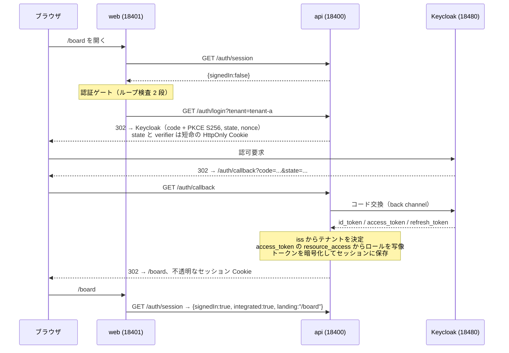
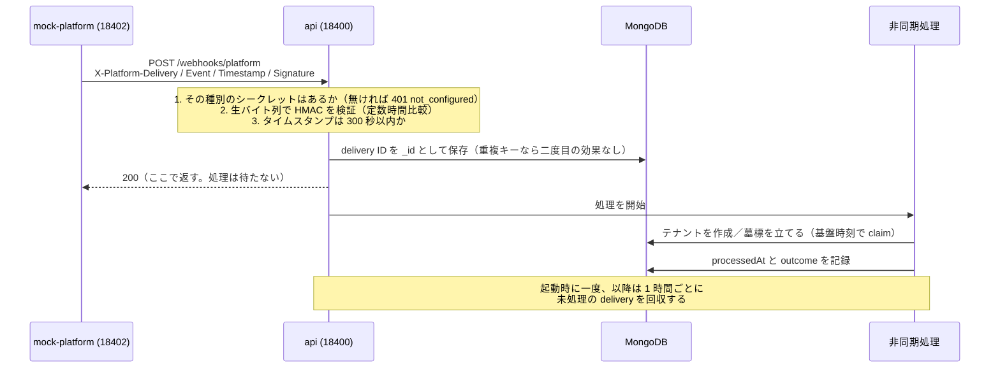

# Acme Tasks — group platform integration demo

**Summary (English).** Acme Tasks is a fictional multi-tenant task SaaS with its own accounts and
sessions. This demo adds a second way in — a group platform's IdP — without adding a second session:
the authorisation code flow with PKCE ends in the application's own server-side session, a platform
Bearer token on the existing API becomes an in-memory principal, and every permission is decided on
the server from one table. Platform events arrive as HMAC-signed webhooks that are stored before they
are acknowledged and processed afterwards; tenants follow the platform with claims and tombstones, and
devices are pulled hourly because the platform sends no device events. Everything is off until it is
configured, and the tenant that is not integrated behaves exactly as before. Keycloak plays the
platform's IdP (one realm per tenant) and a small mock service plays its event, tenant and device
APIs. Built from the specification in
[`specs/001-idp-tenant-integration/`](specs/001-idp-tenant-integration/spec.md); every acceptance row
and its evidence is in [`goal-pack/PROGRESS.md`](goal-pack/PROGRESS.md).

---

## 1. これは何か

「グループ基盤の IdP でログインできるようにする」という要件を、既存の SaaS に後付けで実装した動くデモです。
題材は架空の製品 **Acme Tasks**（マルチテナントのタスク管理 SaaS）と、架空の **グループ基盤** です。

主眼は機能を並べることではなく、**入口が増えても出口は一つに保つ**という設計を、実際に動く形で確かめることに
あります。ブラウザのログインも、他サービスからの Bearer トークンも、最後は自アプリの同じセッションか、
メモリ上の認証主体に収束します。下流のコードは、どちらの経路で入ってきたのかを知りません。

構成は次のとおりです。

| 置き場所 | 中身 |
|---|---|
| `apps/api` | Fastify。ログイン、セッション、Bearer 受理、ロール、権限、Webhook、テナント同期、デバイス取得、定期実行 |
| `apps/web` | React + Rsbuild。認証ゲート、可視性レジストリ、画面 |
| `apps/mock-platform` | グループ基盤の代役。イベント送信、テナント API、デバイス API、テスト用の操作 API |
| `packages/contracts` | API・イベント・基盤 API・可視性・ロール写像表・権限表の凍結済みの型と表 |
| `infra/keycloak/realms` | realm の定義（`platform` / `tenant-a` / `tenant-b`） |
| `specs/001-idp-tenant-integration` | 仕様一式。要件・計画・調査・データモデル・契約・検証シナリオ・測定した事実 |

テナントは 3 つです。`tenant-a` と `tenant-b` は基盤と統合済み、`local` は**統合しない**テナントで、
従来どおりパスワードでログインします。`local` が最後まで変わらないことが、このデモの合否の一つです。

## 2. 動かし方

前提は Docker と Compose、Node 24、`packageManager` で固定した pnpm、そして Playwright 1.62.1 用の
Chromium です。18400–18419 と 18480 が空いている必要があります。

```bash
pnpm stack:up   # Keycloak 26.7.4（realm 3 つ）と MongoDB 7 を起動し、秘密情報を投入する
pnpm install
pnpm seed       # 統合しないテナント local とそのユーザー・タスクを投入する
pnpm test       # 単体・結合テスト
pnpm e2e        # ブラウザのテスト（Playwright が API と web を起動する）
pnpm stack:down # 後片付け（-v を付けるとボリュームも消える）
```

`docker compose up -d` を直接叩くと起動しません。`compose.yaml` が管理者の資格情報を
`${KC_BOOTSTRAP_ADMIN_USERNAME:?...}` の形で要求しているため、env ファイルなしでは Compose が作成前に
止まります。`pnpm stack:up` は、この run 用の秘密情報を OS の一時ディレクトリに mode 600 で生成し、
`--env-file` で渡し、両サービスの healthy を待ってから `scripts/provision.ts` を実行します。
realm のクライアントシークレットと初期ユーザーのパスワードを管理 API 経由で入れているのは、
**Keycloak 26.7.4 が realm インポート内の `${env.NAME}` を展開せず、そのまま文字列として保存するから**です
（測定の記録は `specs/001-idp-tenant-integration/facts.md` の F11）。

`pnpm seed` が要るのは、`local` が「変わらないこと」の基準そのものだからです。テストの一つが、
稼働中の `acme_tasks` データベースに `local` が 3 ユーザー・4 タスクで存在することを確かめます
（FR-031 の基準線）。`node_modules` が必要なので `pnpm install` の後に置いています。

リポジトリには秘密情報を一切置きません。`.env.example` にあるのは設定名とダミー値だけです。

## 3. 設計の要点

- **出口は一つ。** 認可コード + PKCE（S256）で入り、自アプリのサーバーサイドセッションで終えます。
  ブラウザが持つのは不透明なセッション ID だけで、基盤のトークンは AES-256-GCM で暗号化してサーバーに
  預かります。`GET /api/*` はセッションがあればそれで決まり、無いときに限り `Authorization` ヘッダーを読みます。
- **テナントは署名済みトークンの `iss` から導く。** `Host` ヘッダーは見ません。
- **更新の失敗を二つに分ける。** 基盤が明確に拒否したらセッションを失効させ、基盤に届かないときは
  セッションを残して 1 時間後に再試行します。「届かない」は利用者について何も語っていないからです。
- **権限はサーバーが決める。** 操作とロールの表は `packages/contracts` に一つだけあり、`/api/*` の
  すべての経路が自分の操作を宣言し、ハンドラーの前に一度だけ検査します。画面は表を持たず、サーバーの
  403 をそのまま出します。
- **既定はオフ。** issuer が無ければトークンは全て拒否、署名シークレットが無ければイベントは全て拒否、
  デバイス取得も既定で false、テナント単位の統合フラグも既定は非統合です。
- **時刻は注入する。** 本番は実際の間隔（1 時間・30 日）で動き、テストは注入した時計を進めます。
  進めていることはテスト自身に書いてあります。

## 4. シーケンス図

ログイン（US1）:



Webhook（US4）:



## 5. 実務で実施した点

ここに書いたのは、筆者が実務で扱った基盤統合の事例に記載のある設計判断です。数字や固有名詞は書きません。

- 入口が増えても出口は一つ。認可コード + PKCE で入り、自アプリの既存のセッションで終える。下流は変えない。
- 基盤のトークンはサーバー側で暗号化して預かり、自アプリのセッションを基盤のセッションにつなぐ。
- 更新の失敗を区別する。明確な拒否ならセッションを失効、ネットワーク系の一時的なエラーでは殺さない。
- テナントは署名済みトークンの `iss` から導き、`Host` ヘッダーは信用しない。
- 既存 API の Bearer 受理は、既存セッションが無いリクエストに限る。セッションも DB 書き込みも作らない。
- 初回接触の一意化は、部分ユニークインデックスと「重複キーなら読み戻す」。対照群で確かめる。
- ロールは複数クライアントの和集合 → 写像表 → 置き換え。同じなら書かない。写像できないものは降格して警告。
- Webhook は生バイト列で HMAC-SHA256 を検証（定数時間比較・許容 5 分）、イベント ID で一意に保存、
  先に 200 を返して非同期に処理、起動時と毎時に取り残しを回収、シークレットはイベントごとに分ける。
- テナント同期は排他的な claim と墓標。冪等で順不同にも安全。情報が足りなければ client_credentials で
  問い合わせ、「拒否」と「届かない」を区別する。
- デバイスは基盤がイベントを出さないため、毎時とテナント作成時に取得する。失敗しても最終成功時刻は消さない。
- 画面の出し分けは一つのレジストリにまとめ、統合しないテナントでは最初に「隠さない」を返す。
  ログインへの出口は一つの認証ゲートに集め、リダイレクトのループを二段で防ぐ。
- 既定はオフ。
- 並行開発の相手には、名前と形を凍結した契約を先に渡す。

## 6. デモで追加した点

こちらは、このデモのためだけに用意したもので、実務でそうしたという主張ではありません。

- **基盤の代役。** IdP は Keycloak（テナントごとに realm）、イベント・テナント API・デバイス API はモック。
  実務の基盤の挙動を再現したものではなく、設計を確かめるための代役です。
- **SDD → goal 包 → バス。** この仕様の受け入れ条件から goal 包を作り、バスで無人実装しました。
  実務では仕様駆動とバスは別々に使っていました。
- **時計の注入。** 実務では毎時のタイマーを実際に待って確かめました。デモでは注入できる時計で進め、
  そのことをテストに書いています（本番の間隔は実際の値のままです）。
- **モックの操作 API。** 署名の誤り・古いタイムスタンプ・再送・テナント API の拒否や不達を
  テストから起こすための `/__control/*`。
- **一つの Compose。** Keycloak と MongoDB だけを Compose で起動し、Node のサービスはワークスペースから
  直接動かします。

## 7. 仕様駆動の進め方と、記録の在り処

仕様を先に書き、そこから実装の目標を切り出し、各目標の受け入れ条件を**証拠つきで**判定する、という順序で
進めました。読む順番としては次のとおりです。

| 見たいもの | ファイル |
|---|---|
| 何を作るか（要件・明確化・権限・チケットの処遇） | `specs/001-idp-tenant-integration/spec.md` |
| どう作るか、なぜその選択か | `plan.md` / `research.md` |
| 外部システムについて測ったこと（コマンドと出力つき） | `facts.md` |
| 名前と形 | `data-model.md` / `contracts/`（G6 で AS-BUILT に更新） |
| 何を観測すれば合格か（Q1–Q18 と対照群） | `quickstart.md` |
| 作業の単位（T001–T070） | `tasks.md` |
| 各受け入れ条件の判定と証拠 | `goal-pack/PROGRESS.md` |
| 引き継ぎ | `specs/001-idp-tenant-integration/HANDOFF.md` |

守った原則は 4 つです。**外部システムについては測ってから依存する**（`facts.md` に日付・コマンド・出力）。
**ガードは赤を見てから信じる**（対照群のテストが、守りを外すと壊れることを示す）。
**判定は証拠に基づく**（PASS は観測した出力を引用し、確かめられないものは BLOCKED にする）。
**未裁定の設計判断は人に返す**（既定値で埋めない）。

実際、この方針で作ったからこそ見つかった問題がいくつかあります。たとえば ID トークンには
`resource_access` が無く、全ユーザーのロールが空になっていたこと（F18）。たとえば 30 日の間隔を
`setInterval` に渡すと Node が 1 ミリ秒に切り詰め、期限切れ処理が毎秒千回走っていたこと。
どちらも仕様書を読むだけでは出てこず、動かして測って初めて出ました。

---

本デモの「実務で実施した点」は、筆者が公開している事例
[01-platform-integration](https://github.com/MuneAkira6/engineering-case-studies/blob/main/01-platform-integration.md)
に記載した内容にのみ基づいています。実務の数値や固有名詞はこのリポジトリには含めていません。
